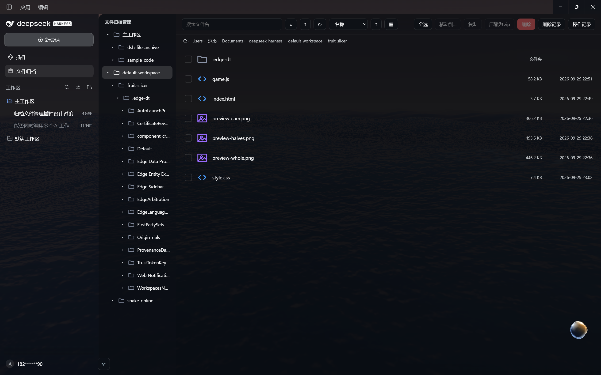

# dsh-file-archive

> **DeepSeek Harness** 的侧栏文件管理器 —— 浏览、预览、移动、删到回收站，
> 管理 AI 在你工作区里生成的文件，全程不离开应用。

[English →](./README.md)



---

## 它是做什么的

DSH 的 AI 会把文件写进你的工作区：报表、表格、图片、代码、压缩包。
`dsh-file-archive` 在侧栏加一个**文件管理面板**，让你查看 AI 产出了什么、
预览它、整理它、清理它 —— 并且安全。

## 功能

**浏览与查找**
- 一个面板覆盖**所有已注册工作区**，带可展开的目录树
- 文件名搜索 **+** 全文内容搜索（有界遍历，跳过二进制 / `node_modules` / 隐藏目录）
- 面包屑导航、可排序列表、列表 / 网格视图

**全类型预览**
- 文本与代码（轻量语法高亮）、Markdown（渲染）、图片、PDF、Office 文档（转 PDF）

**移动与复制**
- 移动到 / 复制到任意文件夹 —— **含跨盘**
- 同盘移动是瞬时 rename；跨盘为「复制 + 删除」，带字节级进度条与取消按钮
- 复制前做目标盘剩余空间预检，冲突可自动重命名 / 覆盖 / 跳过
- 支持拖拽到文件夹，或用按钮 / 右键菜单

**安全删除**
- 删除一律进 **Windows 系统回收站**，绝不永久删除
- 删除记录会记下删了什么、原来在哪

**压缩**
- 把选中的文件/文件夹打包成 `.zip`，以及解压 `.zip` —— 由**零依赖**的内置 ZIP 实现完成

**观感**
- 玻璃拟态弹窗、大圆角、极简线框几何图标
- 自动跟随 DSH 主题（明 / 暗）
- 中英文界面

## 安装

```bash
dsh plugin add dsh-file-archive
```

或直接从本仓库安装：

```bash
dsh plugin add github:baisedoubi111/dsh-file-archive
```

安装后重启 DeepSeek Harness（或重载 profile），侧栏会出现「**文件归档**」图标。

## 平台支持

| 能力 | Windows | macOS | Linux |
|---|---|---|---|
| 浏览 / 预览 / 搜索 / 移动 / 复制 / 压缩 | ✅ | ✅ | ✅ |
| 删除到系统回收站 | ✅ | — | — |
| 「打开所在位置」/「打开回收站」 | ✅ | — | — |

本插件目前是 **Windows 优先**：回收站删除与资源管理器集成使用 Windows API。
其余全部是纯 Node，任何平台都能跑。欢迎贡献 macOS / Linux 的回收站支持。

## 安全模型

本插件能删文件，所以刻意保守 —— 这是**代码强制**（`guards.js`），不是约定：

- **允许名单** —— 只操作「已注册工作区」内的文件。
- **拒绝名单** —— 永不触碰 DSH 数据目录、插件自身目录、系统目录
  （`C:\Windows`、`Program Files` 等）、以及 `.git` / `.dsh` 目录段。
- **只进回收站** —— 没有任何永久删除路径，也没有「清空回收站」按钮。
- **路径校验** —— 所有路径经 `realpath` 解析并做包含性校验；ZIP 解压有 zip-slip 防护。
- **批量上限** —— 单次操作有文件数与总大小上限。
- **零运行时依赖** —— Host 半只用 Node 内置模块和本地模块，绝不会在启动时解析不到包。

完整契约见 [SAFETY.md](./SAFETY.md)。

## 它是怎么搭的

标准的 DSH 双半插件：

- **Host 半**（`index.js`、`guards.js`、`zip.js`）—— 一个 Cordis bundle 插件，在
  `/dsh-file-archive/*` 下挂一套私有 HTTP API。
- **Client 半**（`client.js`）—— 一个 `window.__ModuleLoader__` 打包模块，注册
  `sidebar.panellist` 图标、`main` 面板与 `shell.overlay` 弹窗。

## 开发

开发期以 `link:` 方式安装，改源码后：Host 半下次重启生效，Client 半刷新页面生效。

```
index.js     Host 入口：HTTP 路由 + 引擎
guards.js    允许名单 / 拒绝名单 / 上限
zip.js       零依赖 ZIP 读写
client.js    全部 UI（React.createElement，无需构建）
```

## 许可证

[MIT](./LICENSE)
